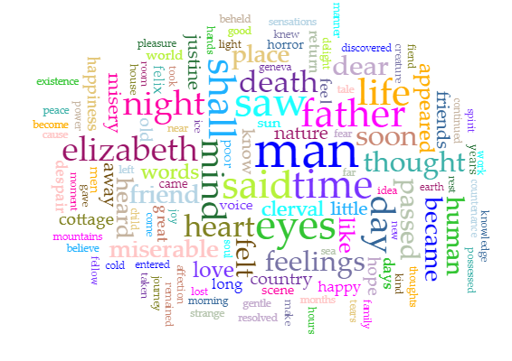

[Home](index.md) | [Portfolio](portfolio.md) | [Resume](resume.md) | [Reflection](reflection.md) 

### Corpus Analysis and Analysis Reflection

For this assignment I was tasked to take two different texts and analyse them using two different programs. The two texts I chose to analyse were Bram Stoker's “Dracula” and Mary Shelly’s “Frankenstein”. I downloaded these stories as text files and ran them through AntConc and Voyant tools. AntConc is a downloadable copus analysis tool, and Voyant tools is a browser analysis tool. Both have their benefits and their faults which will be discussed at the end.

### Immediate discoveries with AntConc

When running both texts through AntConc there is an immediate relationship to be made with the texts. The most seen n-gram (continuous string of words) was the phrase “of the”. The phrase “of the” was seen in Frankenstein 527 times, while in Dracula it was seen 865 times. Another popular one among both stories was “in the” with it being the second most popular in Dracula and third most popular in Frankenstein. There were many of the same phrases throughout that had “I” in the phrase. This is most likely due to the fact that both stories are written in the first person. 

### Looking for the “Monster” 

I chose both of these texts initially because I knew they both had their own “monsters”. I went searching for the term “monster” in AntConc to see what interesting things I could find. I found that both stories described a monster in unfavourable ways. In Dracula the phrase “monster seems despicable” came up and in Frankenstein, “monster ugly” was used. I also noticed that “monster” was used to describe the size rather than a person in Dracula. 

### Cirrus in Voyant

Dracula 
 
Frankenstein 

The Cirrus option in Voyant tools gives a giant word cloud of commonly used words. I put both of the texts into this word cloud to see what I could find. The easiest common word between the two was “said” which would be pretty obvious as they are both dialog driven stories. Both stories utilized the word “man” many times. Looking at this from afar this could have happened because in Frankenstein the word “father” is one of the more prevalent words, and in Dracula both “Johnathan” and “Van/Helsing” are three of the most prevalent words. 

### Reflection

This project was pretty interesting to me. I had used Voyant tools before this project so I had an idea of what was going on with that, but AntConc was new to me. I enjoyed utilizing both, but I do like Voyant more as it is more of a visual tool and I learn better through visual stuff. AntConc was strange because I really was not too sure what a lot of the terms meant at first. Once I used it more and did some other tasks for class I really started to understand what AntConc was all about. N-grams are really useful to quickly get context and understanding of s certain word or set of words. Both of the programs were definitely useful for corpus analysis, but they both can be rather slow and broken. So you have to be patient, but once you know what you are doing that really is not much of an issue. 

