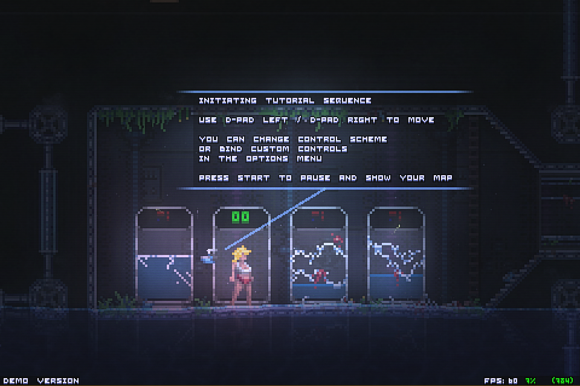
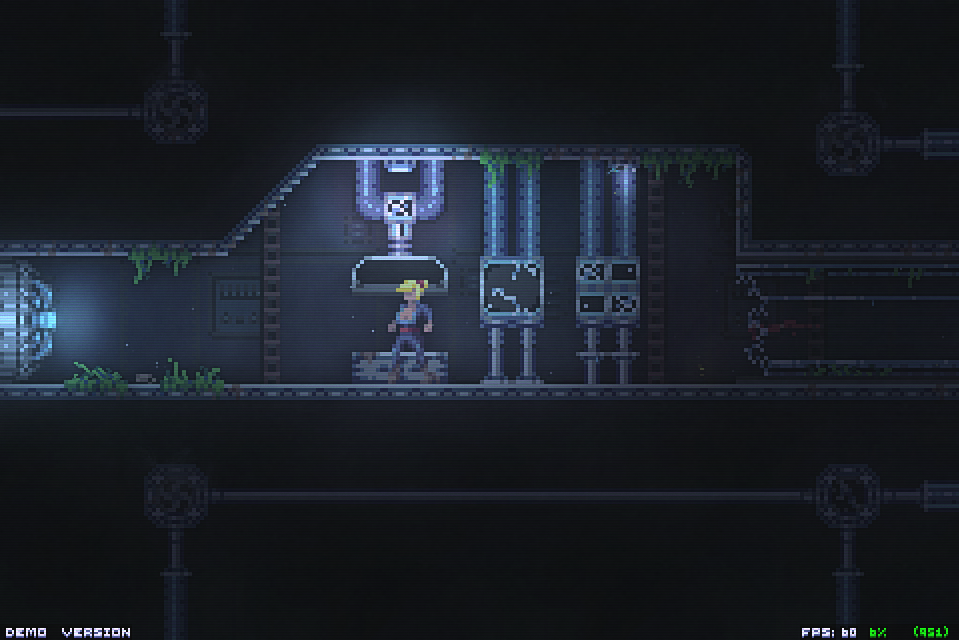
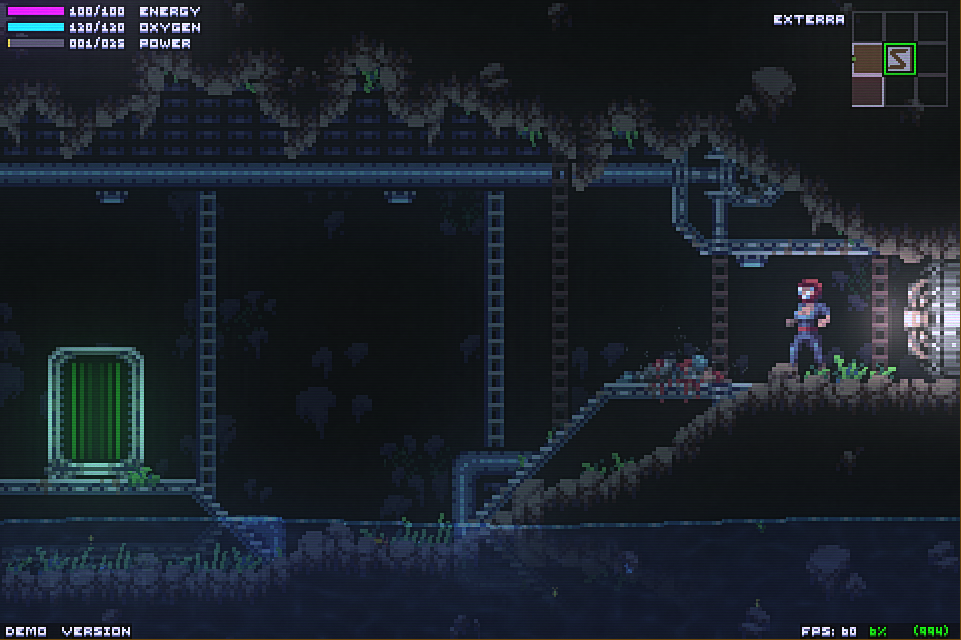
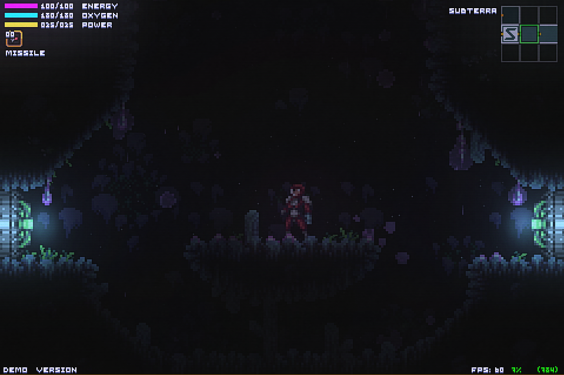
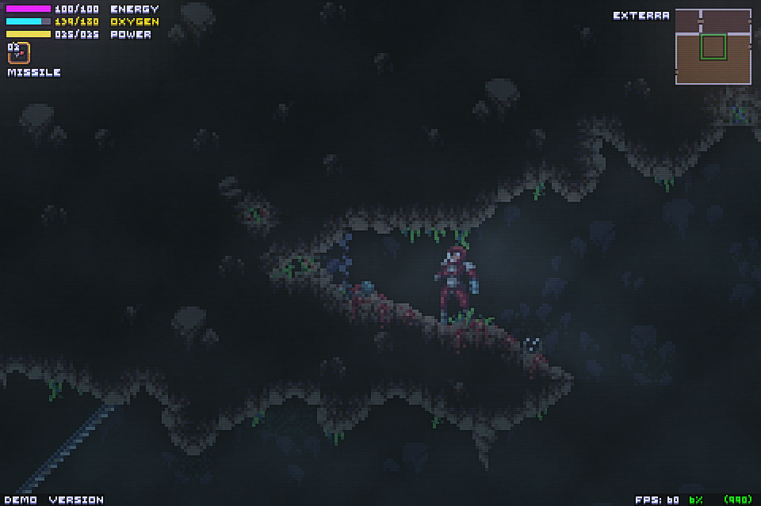
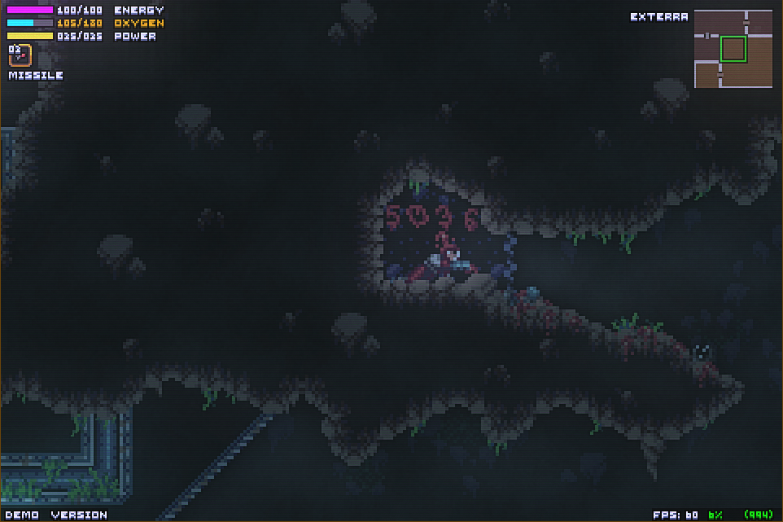

# Game Review 

## Zordak (Demo)

Zordak is a Super Metroid inspired action adventure game. You are a woman that has awoken from a very long cryo sleep to find the planet you are on has been abandoned for a long while. There are corpses that litter where you can explore and some have hints or items that can help you move on in the game. 

## Characters

There really is not a lot to see in the character department. It is basically just you and the creatures that inhabit the planet. There is a small tutorial robot that helps you for the first few minutes of the game, but they disappear pretty quickly leaving it to you and you only. The woman that you control says nothing and does nothing to give her any sort of character development. She has a striking resemblance to that of Samus from the Metroid series throughout her evolution of suits that you aquire. 

## Atmosphere

If you are going to make a game inspired around Super Metroid one of the things that needs to be really good is the atmosphere of the game. Iw ould say that his game does a pretty good job getting it done. There are only a few areas that are accessible in the demo, but each area has its own feel and atmosphere. The pixel art style is well done as the creator put a lot of detail into very simple enemies. The music is also well done as it is more ambient, which is very effective for putting the player into the world. Each area has its own music as well. 

## Puzzles and Secrets

The puzzles and secrets get their own category as they area large part of why the game is fun to play and interesting to the player. So many of the puzzles and secrets are found by slight graphical differences in the environment. The game does a good job teaching the player this early on and has you looking for secrets throughout the rest of the game. These secrets and puzzles feel really rewarding to the player because they may be simple, but they can be hard to spot. 

## Controls

Controls for a game like this can be make or break for a player. To be truly immersed, good controls are a requirement. You want to be tied to your character through the controller and this game does a pretty decent job doing it. I played with a PS4 controller and it was plug and play. Platforming is smooth and shooting while actively moving was a breeze. The only issue I had was getting used to the ledge grab mechanic. Sometimes I would struggle to turn around and ledge grab from holding another ledge grab. This may be just a me thing though as once I got used to it I had no problems. 

## The "Final" Boss

The farthest you can get in the demo is the boss who is titled "Slither". Slither is a giant goop monster that has three eyes and some strange innards that kind of look like organs. You shoot out the eyes while dodging slithers jumping and splashing attacks. This boss fight does a good job utilizing what you have learned up to that point in the game. I found the boss fight to be challenging enough and pretty exciting. 

## Closing thoughts

This demo is a promising look at what hopefully one day will become a full game. Even though I think it may take a little too much from Super Metroid, it does a nice job using the elements that it was inspired by. Since this is only a demo many things are not set in stone yet and I am looking forward to a full release of the game. 

