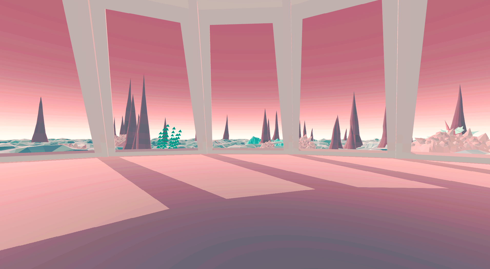
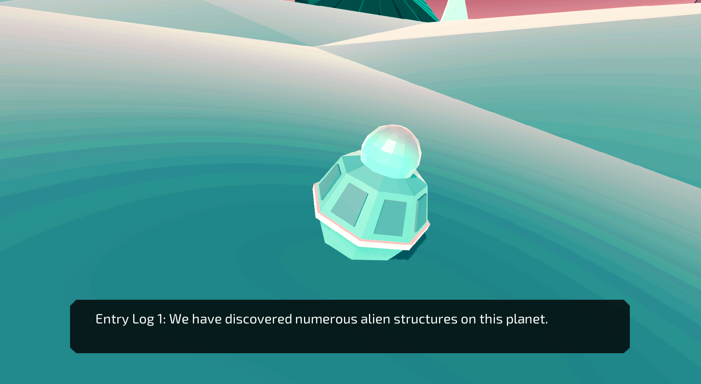
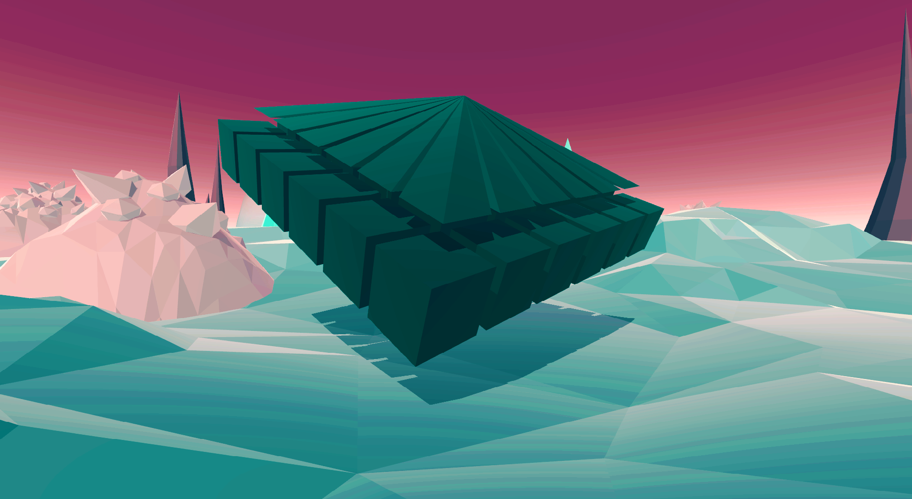
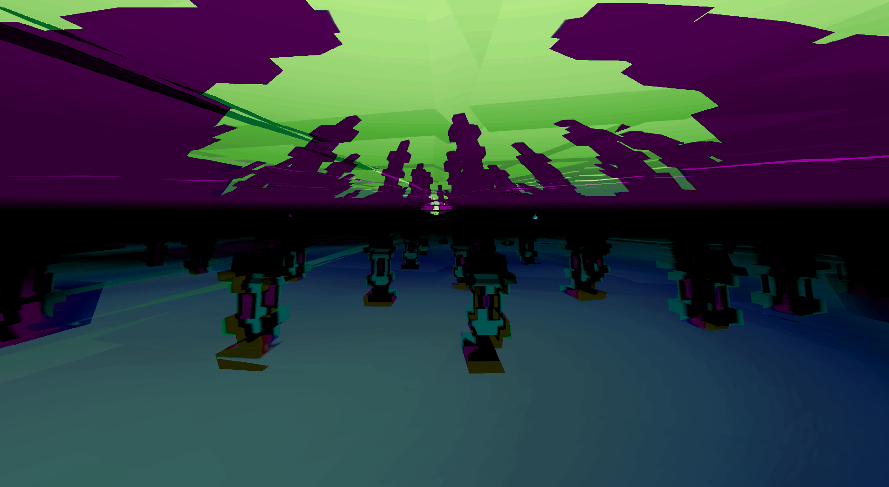
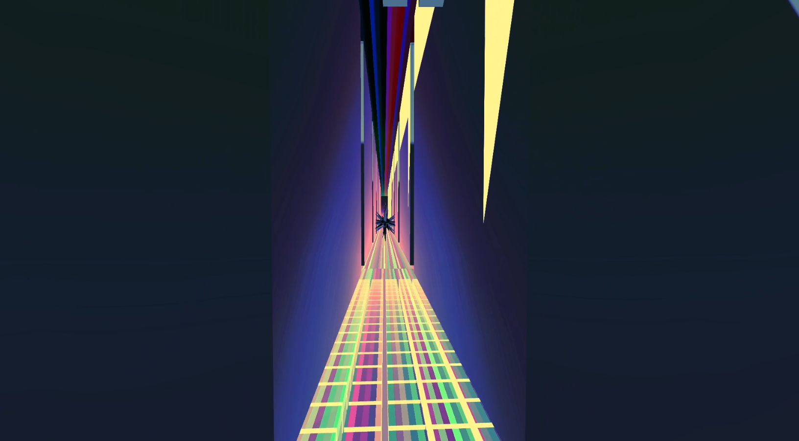

[Home](index.md) | [First Game Review!](game.md)

# Game Review 

## Inside the Void

Inside the Void is an aesthetic walking simulation game. The background story is pretty simple. You are sent to a strange planet to find crew members that were sent before you and never returned. You get there to find out that there are several "voids" that are different from their surroundings on the planet. You venture through each of the voids and find out clues as to why and how the previous crews have disappeared. It is a short, but pleasant, experience. 

## Characters

There really is not a lot to the character in this game. You are simply a crewmate that arrived on a ship and you walk around. There really is not a lot of character development as the game is based around what you are looking at rather than what you are doing. 

## Atmosphere

This is the biggest and strongest point of the game, in fact is it the point of the game. The limited amount of actual gameplay is contrasted by the extremely interesting visuals and atmospheric music that is present everywhere in the game. The main hubworld that contains all of the voids is a pleasant pink and blue, and the graphics are all very basic polygonal shapes. This may be a turn off to some that link simulation and realistic graphics, but I think this game does a wonderful job with the direction it was going for. The game is eye candy, and that does not change when you enter the voids, and the other sections of the later game. 

## Tones

This game, while appealing to look at, is really good at unsettling tones. You would not initially think a game with this kind of color palette would be unsettling, but the game does a wonderful job showing you strange void creatures. The creature sightings are always almost out of the corner of your eye. Almost gives you the feeling of being watched, or that you should be watching your back. The sound direction of the game also contributes heavily to the unsettling tone and atmosphere. When going from void to void there are music changes that are all very ambient and add to that particular voids tone.  

## Closing thoughts

I think this game is extremely well done. It is a short walking simulator type and some people may be off put by that, but the experience is well worth it. I would say that the screenshots do not do the game justice, and I would suggest sitting down and playing through it. It will only take about half an hour of your time. Another thing you could do is watch my playthrough video of it. I talk about a lot of what I said here, but looking at the moving game is a lot different than getting your information through screenshots. The video is long and unedited so feel free to skip around. 
