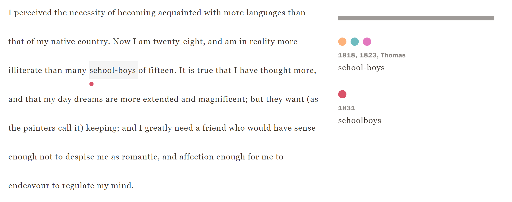
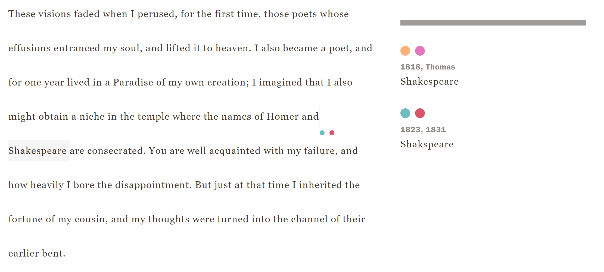
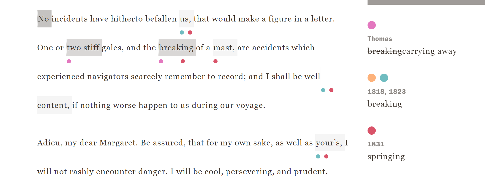
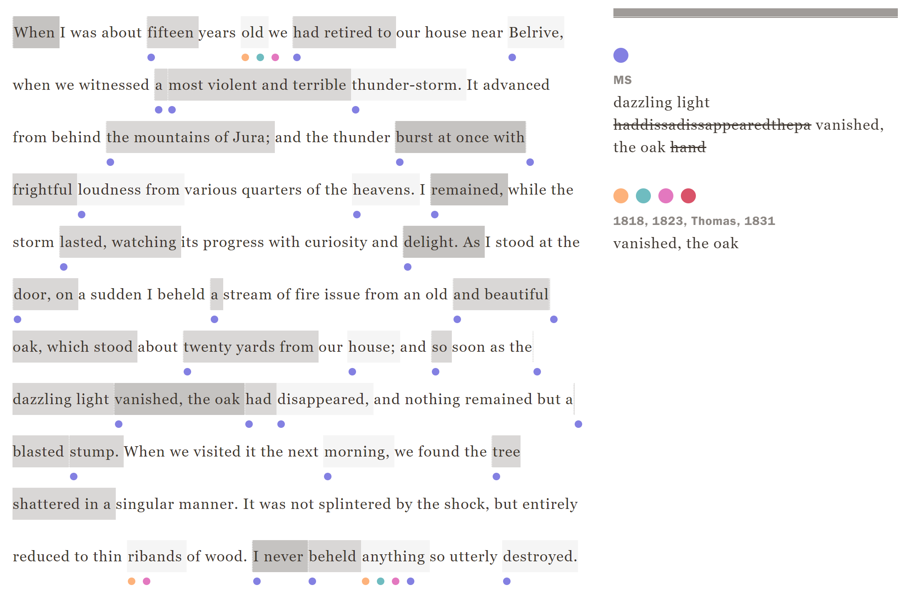

[Home](index.md)

# Frankenstein Variorum Reflection

## What is it? 

The Variorum is a website that is dedicated to collecting and documenting five different versions of Mary Shelley's book *Frankenstein*. The five versions of the book being the MS, 1818, Thomas, 1823, and the 1831 versions.  

## The 1831 edition. 
I found that the 1831 edition has a ton of smaller little spelling and punctuation differences. A lot of the time its just a comma added here or a colon changed to a semi colon. One of the more interesting things I found was that of the name Shakespear. Several times Shakespear's name comes up and it changes from one version to the next. It is either __*Shakspeare*__ or __*Shakespeare*__. Sometimes just one word is changed in context. The 1831 version also tends to add a ton of context or extra details that are absent in the other versions.  

## The MS notebook
The MS version is very much incomplete, but the sections that are there are really interesting. It very much feels like this version was just kind of figuring out what words were best in different contexts. There are a lot of ~~strikethrough~~ words. Many of the words are just slightly different than in the finished versions. It provides a really interesting look into the thought process of what the book would end up being.  

## The Website
The site navigation is very straightforward and easy to use. To figure out where you are and where you want to go is as easy as it can be. The Variorum itself is also straightforward to understand. At the top there are three different options. Those options include; Version, Section, and option boxes to see Variants, Annotations, and Text. This makes it easy to get directly where you want to go. If you scroll all the way to the bottom, these options are also there again so you do not have to scroll all the way back to the top which is an insanely nice thing to have and I wish more websites had this. Exploring the text is also easy. It is as simple as clicking on what you want to explore. The changes between each version appear on the right side of the screen which makes it really nice to compare and contrast each version. I like how each version has its own dedicated color that is represented throughout the text.

Overall I do think the website does the job very well. It is easy to navigate and very easy on the eyes, which is harder to do than you think. A lot of websites that are based around text can be tough to look at for long periods of time, and I feel this website negates that problem very well with the colors and font families that are used. Once I knew what I was looking at and looking to find the site is very accessible and easy to use.
